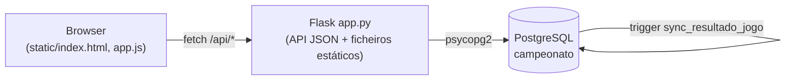

# Campeonato do Algarve

<p align="center">
  
  
  
  
</p>

Base de dados PostgreSQL de um campeonato de futebol fictício — o **Campeonato do
Algarve** — modelada com dados reais de 6 clubes algarvios, mais uma aplicação
Flask que gera o calendário da época e simula jornadas (golos, marcadores,
cartões) em vez de inserir resultados fixos à mão.

Projeto final de base de dados do CET (curso técnico-profissional). A entrega
académica é um relatório em PDF (`relatorio_projeto_final.pdf`, não incluído
neste repositório); este código é a implementação viva por trás desse
relatório — schema, dados de teste e a mini-aplicação que gerou as
jornadas/golos/cartões fictícios.

## Visão geral

- **Dados reais:** nomes, cidades, anos de fundação, estádios, treinadores e
  161 jogadores dos 6 clubes, extraídos do [zerozero.pt](https://www.zerozero.pt)
  por um scraper próprio (`scrape_clubes_algarve.py`).
- **Dados fictícios:** jornadas, jogos, golos e cartões — nunca devem ser lidos
  como factos reais sobre os clubes/jogadores. São gerados por um simulador
  estatístico próprio, ao estilo Football Manager.
- **Aplicação:** um único processo Flask serve a API JSON e um dashboard
  estático (HTML/CSS/JS puro, sem framework) com 5 secções — Classificação,
  Jornadas, Jogadores, Clubes e Estatísticas.

## Funcionalidades

- Geração do calendário da época por round-robin ("circle method") — 6 clubes,
  5 jornadas, 15 jogos, cada equipa joga com todas as outras uma vez.
- Simulação de uma jornada de cada vez: golos por distribuição de Poisson
  (amostragem de Knuth, sem dependência de `numpy`), marcador escolhido por
  peso de posição (avançados mais prováveis que defesas/guarda-redes), cartões
  amarelos/vermelhos por probabilidade independente por jogador.
- Tabela classificativa calculada em SQL (pontos, V/E/D, golos, diferença).
- Listagem de jogadores com pesquisa por nome e filtros por clube, posição e
  nacionalidade.
- Perfil de cada clube (estádio, treinador, estatísticas, plantel expansível).
- Painel de estatísticas: topo marcadores, topo cartões, golos por jornada e
  por posição, em gráficos de barras feitos à medida.
- Reinício da época (apaga jornadas/jogos/golos/cartões e volta ao estado
  inicial, com confirmação no browser).
- Sincronização automática do resultado do jogo via trigger PostgreSQL
  (`sync_resultado_jogo`) sempre que se insere/apaga um golo — a aplicação
  nunca escreve `jogo.golos_casa`/`golos_visitante` diretamente.

## Stack

| Camada | Tecnologia |
|---|---|
| Backend | Python + Flask |
| Base de dados | PostgreSQL (`psycopg2`) |
| Frontend | HTML, CSS e JavaScript puro (sem framework, sem build step) |
| Extração de dados | `requests` + `beautifulsoup4` (scraping de zerozero.pt) |

## Arquitetura



A tabela `golo` é a fonte da verdade dos resultados; os campos
`jogo.golos_casa`/`golos_visitante` são um cache recalculado pelo trigger
sempre que `golo` muda.

## Começar

### Pré-requisitos

- Python 3
- PostgreSQL a correr localmente

### Instalação

```bash
git clone https://github.com/DrNOFX97/campeonato-algarve.git
cd campeonato-algarve

python -m venv .venv
source .venv/bin/activate      # Linux/macOS
pip install -r requirements.txt
```

No Windows (PowerShell):

```powershell
python -m venv .venv
.venv\Scripts\Activate.ps1
pip install -r requirements.txt
```

### Configuração da base de dados

Cria a base de dados e corre os scripts SQL **por ordem** (a 05 é opcional —
só as queries do desafio de exploração, não é usada pela aplicação):

```bash
createdb campeonato

psql -U postgres -d campeonato -f 01_campeonato_futebol_schema.sql
psql -U postgres -d campeonato -f 02_dados_teste.sql
psql -U postgres -d campeonato -f 03_atualizar_logos.sql
psql -U postgres -d campeonato -f 04_views_e_trigger.sql
psql -U postgres -d campeonato -f 05_desafio_exploracao.sql   # opcional
```

Variável de ambiente:

| Variável | Obrigatória | Descrição | Valor por omissão |
|---|---|---|---|
| `CAMPEONATO_DSN` | Não | Connection string do `psycopg2` para o Postgres | `host=localhost dbname=campeonato user=postgres` |

### Utilização

```bash
python app.py
```

Abre [http://localhost:5000](http://localhost:5000). No painel **Jornadas**,
usa "Gerar calendário" e depois "Simular Jornada N" para cada uma das 5
jornadas.

## API

| Método | Rota | Descrição |
|---|---|---|
| `GET` | `/api/classificacao` | Tabela classificativa (pontos, V/E/D, golos) |
| `GET` | `/api/jornadas` | Lista as jornadas com estado e respetivos jogos |
| `GET` | `/api/jogadores` | Lista completa de jogadores |
| `GET` | `/api/clubes` | Perfil e estatísticas de cada clube |
| `GET` | `/api/estatisticas` | Topo marcadores/cartões, golos por jornada/posição |
| `POST` | `/api/calendario/gerar` | Gera as 5 jornadas + 15 jogos (uma vez só) |
| `POST` | `/api/jornadas/<numero>/simular` | Simula os jogos dessa jornada |
| `POST` | `/api/epoca/reiniciar` | Apaga cartões/golos/jogos/jornadas |

Erros são devolvidos como `{"erro": "..."}` com HTTP 4xx.

## Estrutura do projeto

```text
campeonato-algarve/
├── app.py                          # Backend Flask + API
├── requirements.txt
├── 01_campeonato_futebol_schema.sql  # Schema (8 tabelas, constraints, índices)
├── 02_dados_teste.sql                # Dados reais dos clubes/jogadores
├── 03_atualizar_logos.sql            # Logos dos clubes
├── 04_views_e_trigger.sql            # Views + trigger de sincronização
├── 05_desafio_exploracao.sql         # 5 queries de exploração
├── scrape_clubes_algarve.py          # Scraper zerozero.pt -> clubes_algarve.json
├── gerar_inserts.py                  # clubes_algarve.json -> 02_dados_teste.sql
├── atualizar_logos.py                # Atualiza só os logos
├── clubes_algarve.json               # Dados extraídos (fonte dos INSERTs)
├── static/                           # Frontend (HTML/CSS/JS puro)
│   ├── index.html
│   ├── app.js
│   └── style.css
└── docs/superpowers/specs/           # Spec de design do simulador
```

## Testes

Sem suite de testes automatizada — âmbito académico, verificação manual:
gerar o calendário, simular as 5 jornadas uma a uma e confirmar que a tabela
classificativa fecha com 15 jogos e cada equipa jogou 5.

## Nota sobre os dados

Nomes/estádios/treinadores/plantéis reais são usados apenas para fins
educativos e não comerciais (ver `scrape_clubes_algarve.py`). Jornadas, jogos,
golos e cartões são inteiramente fictícios, gerados pelo simulador — não
representam resultados ou eventos reais.

## Licença

Não existe ficheiro de licença neste repositório.
